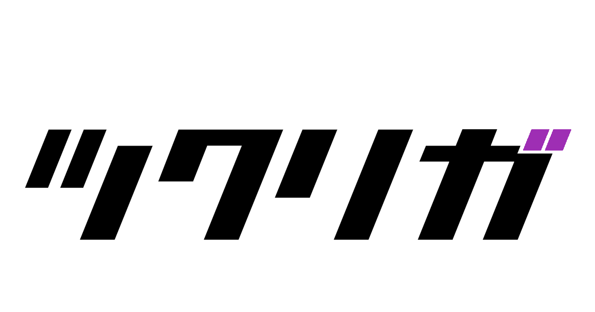

# Tsukuriga
[Altwug.net](https://altwug.net)を継承する自主制作動画専用の投稿サイト
名前は「作\(ツクり\)画(ガ)」から。アイコンは「乍」

## 貢献
[CONTRIBUTING.md](.github/CONTRIBUTING.md)

## 開発
必要なもの
* docker
* docker-compose

#### 開発サーバーの起動
```bash
$ ./scripts/setup.sh
$ docker-compose up -d
```

#### コマンド一覧
```bash
# 静止画サムネイル生成と動画のエンコード
$ docker-compose run web python manage.py encode
# gifサムネイル生成
$ docker-compose run web python manage.py gif
# 動画ランキング生成
$ docker-compose run web python manage.py ranking
# ユーザーランキング生成
$ docker-compose run web python manage.py contrib
```

## Author

https://github.com/Compeito/tsukuriga/graphs/contributors
